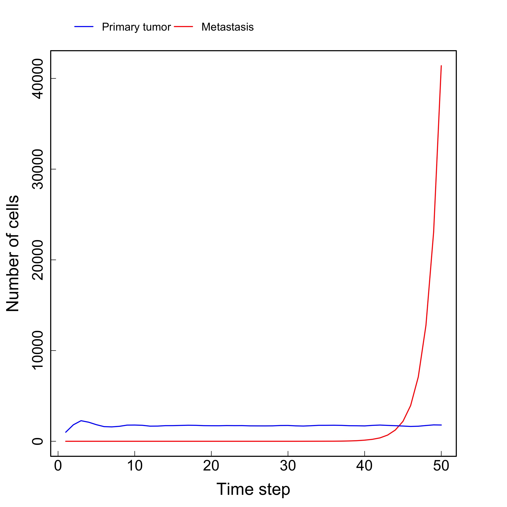
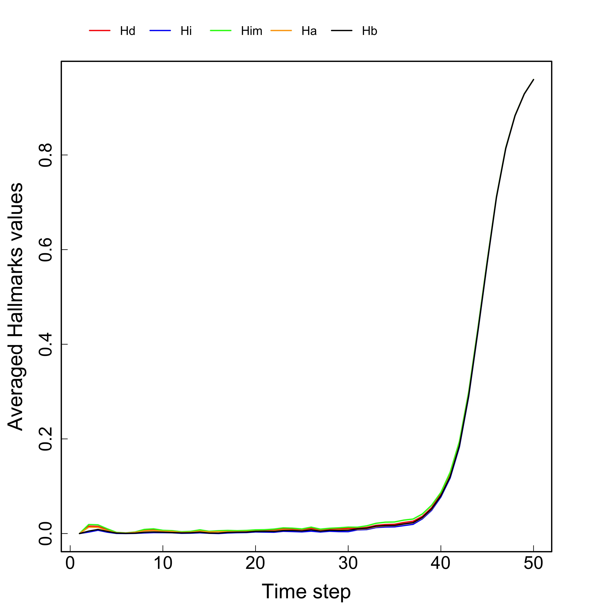
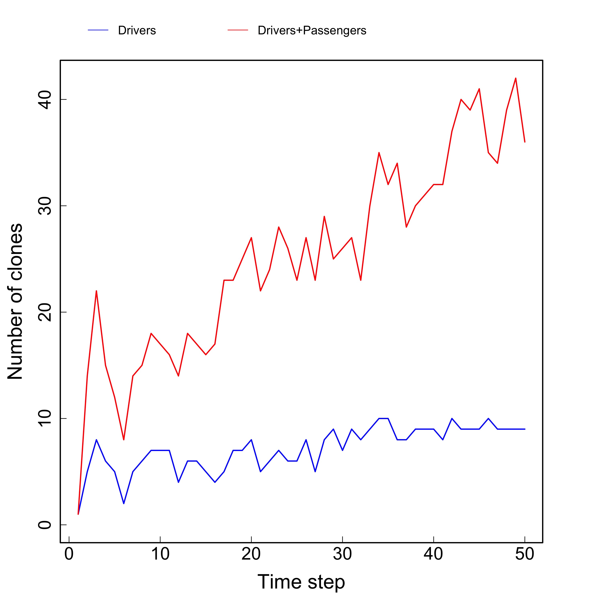
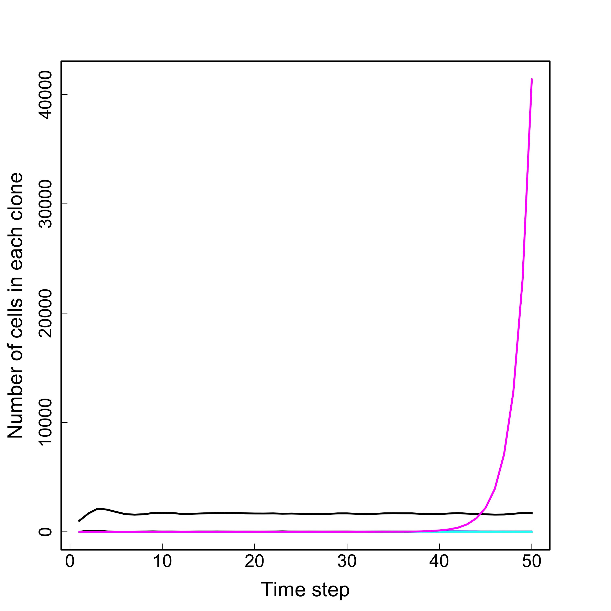
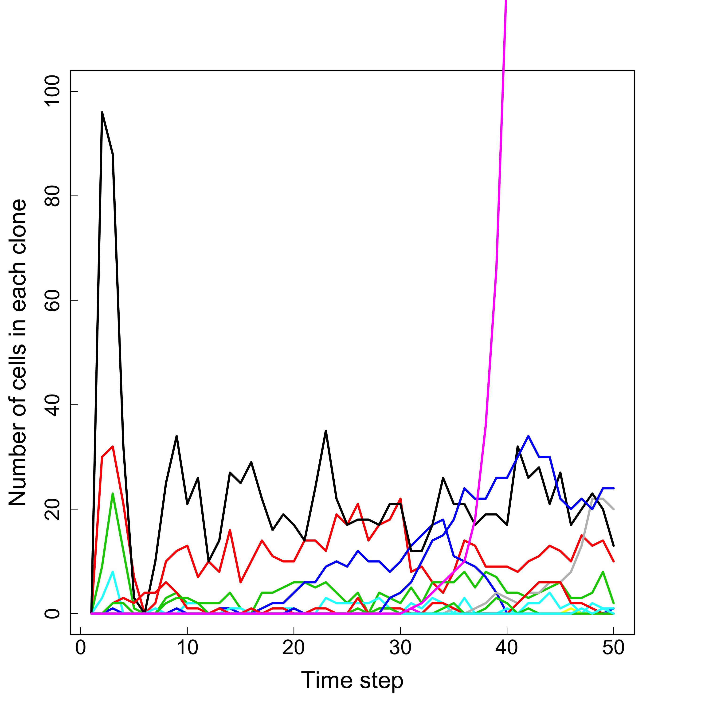
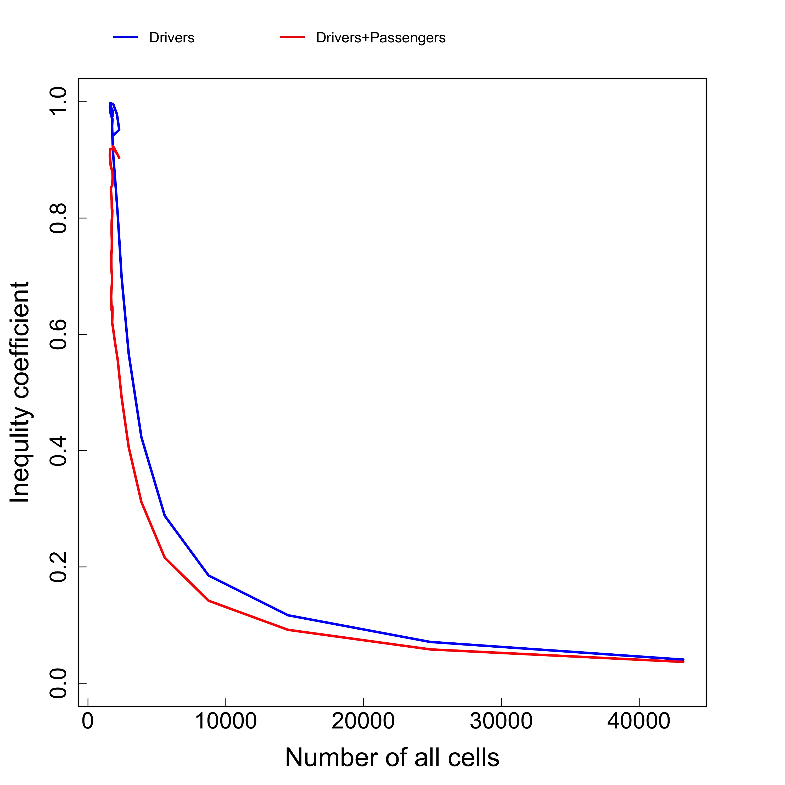

```{r setup, include = FALSE}
knitr::opts_chunk$set(
  fig.path='tugHall/Figures/',
  echo=FALSE, 
  warning=FALSE, 
  message=FALSE,
  collapse = TRUE,
  comment = "#>"
)

Sys.setenv("TimeZone" = "Japan")
```


##Requeirements

R version **3.6**

libraries: **stringr, ape, ggplot2, ggtree** 

Note program has two different procedure in general: the first is simulation and the second is an analysis of simulation. 
This User-Guide is dedicated to the **analysis** part only.
This part of program can work only after simulation, when in **tugHall/Output/** folder the **cellout.txt** file exists. 

# Table of Contents
1. [Quick start guide](#quick)
2. [On the inputs](#inputs)
3. [On the outputs](#outputs)
4. [Figures](#figures)


<a name="quick"></a>

#1. Quick start guide 

To perform a simulation, please, see **User-Guide-tugHall** file. After simulation there is **tugHall/Output/cellout.txt** file, which is used to analyse the cells evolution. Also some functions and objects are used after simulation, so please, load **.RData** file saved after simulation, if it is needed. 

The simplest way to analyze results after simulation:

- open R;
- make the working directory to "tugHall/";
- load .RData;
- source("Code/Analysis.R").

The code has initial input parameters and input files in /Input/ folder to define names of genes. 
In the regime of dialogue user can see results of simulation, which will save to the /Output/ and /Figures/ folders. 

<a name="inputs"></a>

#2. On the inputs 

To analyze the output data user has to get results of simulation in the **tugHall/Output/cellout.txt** file and the functions and objects of simulations should be present in the enveronment of R. 
That is why the **cellout.txt** file is input file for the analysis. 
To get detailed information on it, please, see **User-Guide-tugHall** section "On the outputs".


<a name="outputs"></a>

#3. On the outputs 

Output data content several files and many figures:

- "Order_of_dysfunction.txt" has information about order of gene dysfunction during evolution. 
- "VAF.txt" file has information about variant allele frequencies for each gene and each site in the genes, which were mutated. 
- the folder "tugHall/Figures/" has many plots (see  [Figures](#figures)).

### "Order_of_dysfunction.txt" file

**"tugHall/Output/Order_of_dysfunction.txt"** has information about order of gene dysfunction during evolution in the next format (first 10 lines):

```{r, echo=FALSE, results='asis'}
x <- read.csv(file = "tugHall/Output/Order_of_dysfunction.txt",header = TRUE, sep = "\t", nrows = 10)
x[is.na(x)] <- ""
names(x) <- c("Order of gene dysfunction","Number of cells")
knitr::kable(x, align = "c", caption = "**Table 1. Order of gene dysfunction.**")
```

1. **Order of gene dysfunction.** Order of gene dysfunctionis is the list of gene's names in the order of mutations - from first to last. Blank line is related to the cells without dysfunction.
2. **Number of cells.** The number of cell is number of cells in the pool with same order. 

---

### "VAF.txt" file

**"tugHall/Output/VAF.txt"** file has information about variant allele frequencies (VAF) for each gene and each site in the genes, which were mutated (first 10 lines):

```{r, echo=FALSE, results='asis'}
x <- read.table(file = "tugHall/Output/VAF.txt",header = TRUE, sep = "\t", nrows = 10)
x[is.na(x)] <- ""
knitr::kable(x, align = "c", caption = "**Table 2. Variant allele frequencies.**")
```


1. **DriverPasngr** - D or P are indicated the distinction between Driver and Passenger genes.

2. **Gene** - name of gene, e.g. TP53, KRAS.

3. **Position** - position at mutated site in gene,  e.g. 123, 1028.

4. **VAF_Primary** - VAF for Primary cells = half of N_mutated_Primary / N_Primary cells, e.g. 0.2.

5. **Ncells_Primary_wMutation** - number of Primary mutated cells N_mutated_Primary, e.g. , 40.

6. **Ncells_Primary** - number of Primary cells, e.g. 100.

7. **VAF_Metastatic** VAF for Metastatic cells = half of N_mutated_Metastatic / N_Metastatic, e.g. 0.35. 

8. **Ncells_Metastatic_wMutation** number of Metastatic mutated cells N_mutated_Metastatic, e.g. 70.

9. **Ncells_Metastatic** number of Metastatic cells N_Metastatic, e.g. 100.

10. **VAF_PriMet** VAF for all cells = half of N_mutated_cells / N_all, e.g. 0.275 

11. **Ncells_PriMet_wMutation** number of all mutated cells, e.g. 110.

12. **Ncells_PriMet** number of all cells, e.g. 200.

---


<a name="figures"></a>

#4. Figures 

The directory "Figures/" contents many output figures, generated during analysis process of "cellout.txt" file, including evolutions of number of primary tumor and metastasys cells (Fig.1 left), hallmarks (Fig.1 right) and probabilities (Fig.2 left). 

 
**Fig.1. Results of simulation: left -** evolution of number of cells, **right -** evolution of hallmarks. Files are *tugHall/Figures/N_cells.jpg*  and *tugHall/Figures/Hallmarks.jpg*.


---

 
**Fig.2. Results of simulation: left -** evolution of probabilities, **right -** evolution of number of clones. Files are *tugHall/Figures/Probabilities.jpg*  and *tugHall/Figures/N_clones.jpg*.


---

Fig.2 right shows the evolution of number of clones. Here we have to define clone in simulation is pool of cells with a same set of mutated genes for driver only or for all mutations (driver and passenger genes together). For this propose we define clone ID as bunary number of mutated genes, please, see "cellout.txt" file for columns "Clone.number", "Passengers.Clone.number" and "Mix.Clone.number". Also analysis can calculate the evolution of number of cells in each clone:


 
**Fig.3. Results of simulation: left -** evolution of number of cells in clones, **right -** same plot with scale out. Files are *tugHall/Figures/N_cells_in_clones_1.jpg*  and *tugHall/Figures/N_cells_in_clones_2.jpg*.

---

Fig.4 shows number of cells in each clone at last time step to see which clone is dominant and prevails above others:

 
**Fig.4. Results of simulation: left -** barplot for number of cells in clones for driver mutated clone, **right -** same plot for all mutated cells. Files are *tugHall/Figures/Barplot_N_cells_in_clones.jpg*  and *tugHall/Figures/Barplot_N_cells_in_clones_DP.jpg*.

---

During the simulation each cell has "ID of clone", which calculated from binary code of mutated genes. For example, if gene is mutated then its value in binary code equal 1, and if no, it is 0. For example, the cells have only 4 genes in simulation, so "ID of clone" can have binary numbers from 0000 to 1111,  that is related decimal numbers from 0 to 15. Each cell has information about parent ID and time of birthday, so it is possible to calculate cells with same "ID of clone", after that find cell with earlest birthday and get parent ID of it. Using this parent ID to find "ID of clone" for parent, which is related parent of clone. Follow this procedure we find all relations between parent and children for clones and construct the tree for clones (cells) at last time step (Fig.5).

 

 
**Fig.5. Tree of clones at last time step.** The numbers of tree indicate the ID of clones (**upper** is the plot using plotTreeTime function from ape package, **lower** is the plot using ggtree package). Files are *tugHall/Figures/Tree_clones.jpg* and *tugHall/Figures/ggtree_clones.jpg*. 


---

Figs.6 and 7 show inequality coefficients (for driver mutated cells and for any type mutation) as function of:

- time step;

- number of all cells; 

- number of primary tumor cells; 

- number of metastasis cells.


 
**Fig.6. Results of simulation of inequality coefficient for driver mutated cells and for cells with any type mutations: left -** evolution of inequality coefficient, **right -** inequality coefficient as function of all cells. Files are *tugHall/Figures/Inequality.jpg* and *tugHall/Figures/Inequality_all_cells.jpg*. 


 
**Fig.7. Results of simulation of inequality coefficient for driver mutated cells and for cells with any type mutations: left -** inequality coefficient as function of primary tumor cells, **right -** inequality coefficient as function of metastasis cells. Files are *tugHall/Figures/Inequality_primary.jpg* and *tugHall/Figures/Inequality_metastasis.jpg*.


--- 

