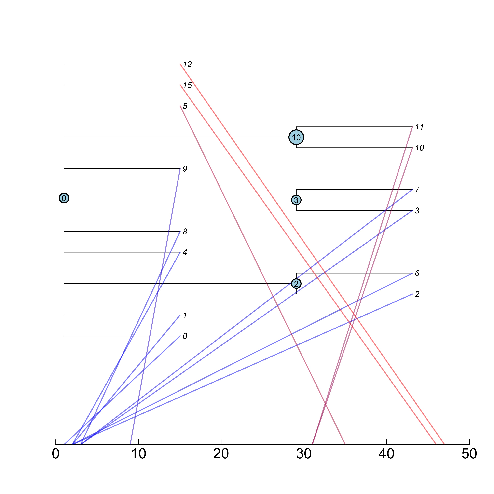
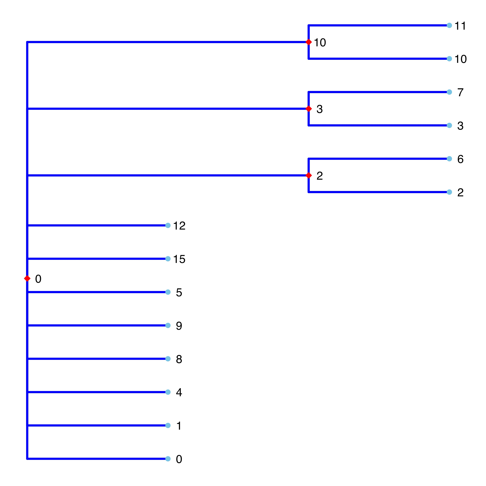
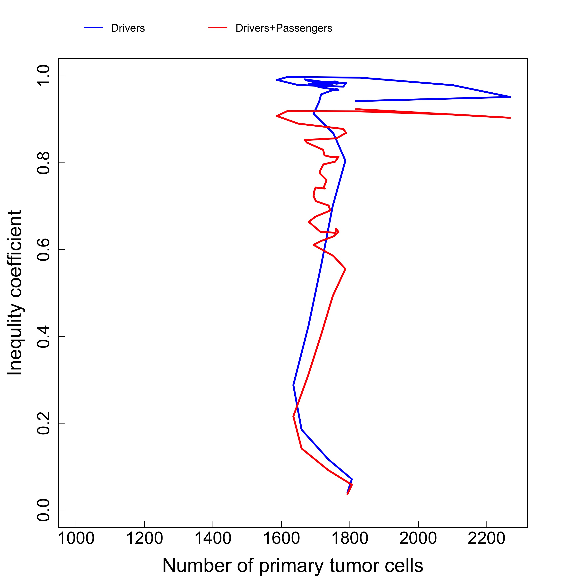

```{r setup, include = FALSE}
knitr::opts_chunk$set(
  fig.path='tugHall/Figures/',
  echo=FALSE, 
  warning=FALSE, 
  message=FALSE,
  collapse = TRUE,
  comment = "#>"
)

Sys.setenv("TimeZone" = "Japan")
```


## Requirements

R version **3.6**

Libraries: **stringr, ape, ggplot2, ggtree** 

Operation systems: Window, Mac. The code for analysis is not tested under Linux based systems.

Note that the program comprises two different procedures in general: the first is simulation and the second is the analysis of the simulation results. 
This User-Guide pertains to the **analysis** alone.
The programs for the analysis can be run only after the simulation is completed, and the **cellout.txt** file exists in the **tugHall/Output/** folder. 

# Table of Contents
1. [Quick start guide](#quick)
2. [Inputs](#inputs)
3. [Outputs](#outputs)
4. [Figures](#figures)
5. [Relation to experimental measurements](#relation)


<a name="quick"></a>

# 1. Quick start guide 

To perform the simulation, kindly see the **User-Guide-tugHall** file. After the simulation the file **tugHall/Output/cellout.txt** is generated, which is used to analyze the evolution of cells. Also, since the functions and objects are used after the simulation, the **.RData** file saved after the simulation must be loaded, if required. 

The simplest way to analyze the results after simulation:

- open R;
- set **tugHall/** as the working directory;
- load **.RData**;
- `source("Code/Analysis.R")`.

The code has initial input parameters and input files in the **/Input/** folder to define the names of the genes. 
In the dialogue box, the user can see the results of the simulation, which will be saved to the **/Output/** and **/Figures/** folders. 

<a name="inputs"></a>

# 2. Inputs 

To analyze the output data, the user has to obtain the results of the simulation in the **tugHall/Output/cellout.txt** file and the functions and objects of simulations should be present in the R environment. 
That is why the **cellout.txt** file is the input file for the analysis. 
For detailed information, kindly see the "Outputs" section in **User-Guide-tugHall**.


<a name="outputs"></a>

# 3. Outputs 

Output data contain several files and figures:

- **Order_of_dysfunction.txt** has information about the order of gene dysfunction during evolution. 
- **VAF.txt** file has information about the variant allele frequencies (VAFs) for each gene and each site in the genes.
- the folder **tugHall/Figures/** has many plots (see [Figures](#figures)).

### **Order_of_dysfunction.txt** file

**tugHall/Output/Order_of_dysfunction.txt** has information about the order of gene dysfunction during evolution in the next format (only first 10 lines are presented here):

```{r, echo=FALSE, results='asis'}
x <- read.csv(file = "tugHall/Output/Order_of_dysfunction.txt",header = TRUE, sep = "\t", nrows = 10)
x[is.na(x)] <- ""
names(x) <- c("Order of gene dysfunction","Number of cells")
knitr::kable(x, align = "c", caption = "**Table 1. Order of gene dysfunction.**")
```

1. **Order of gene dysfunction.** Order of gene dysfunctionis is the list of gene names in the order of mutations - from first to last by left to right. The blank line is related to the cells without dysfunction.
2. **Number of cells.** This is the number of cells in the pool with the same order. 

---

### **VAF.txt** file

**tugHall/Output/VAF.txt** file has information about the VAFs for each gene and each site in the genes (first 10 lines):

```{r, echo=FALSE, results='asis'}
x <- read.table(file = "tugHall/Output/VAF.txt",header = TRUE, sep = "\t", nrows = 10)
x[is.na(x)] <- ""
knitr::kable(x, align = "c", caption = "**Table 2. Variant allele frequencies.**")
```


1. **DriverPasngr** - D or P indicate the distinction between the Driver and Passenger genes.

2. **Gene** - name of gene, e.g. TP53, KRAS.

3. **Position** - position at mutated site in the gene,  e.g. 123, 1028.

4. **VAF_Primary** - VAF for cells in the primary tumor = half of Ncells_Primary_wMutation / Ncells_Primary, e.g. 0.2.

5. **Ncells_Primary_wMutation** - number of primary-tumor cells, e.g. , 40.

6. **Ncells_Primary** - number of primary-tumor cells, e.g. 100.

7. **VAF_Metastatic** VAF for metastatic cells = half of Ncells_Metastatic_wMutation / Ncells_Metastatic, e.g. 0.35. 

8. **Ncells_Metastatic_wMutation** = number of metastatic cells with the mutation, e.g. 70.

9. **Ncells_Metastatic** = number of metastatic cells, e.g. 100.

10. **VAF_PriMet** VAF for all cells = half of Ncells_PriMet_wMutation / Ncells_PriMet, e.g. 0.275 

11. **Ncells_PriMet_wMutation** number of all mutated cells, e.g. 110.

12. **Ncells_PriMet** number of all cells, e.g. 200.

---


<a name="figures"></a>

# 4. Figures 

The directory **Figures/** contains many output figures, generated during the analysis process of **cellout.txt** file, including the evolution of the number of primary tumors and metastasis cells (Fig.1 left), hallmarks (Fig.1 right), and probabilities (Fig.2 left). 


 
**Fig.1. Results of the simulation: left -** evolution of number of cells, **right -** evolution of hallmarks. Files are *tugHall/Figures/N_cells.jpg* and *tugHall/Figures/Hallmarks.jpg*.


---

 
**Fig.2. Results of the simulation: left -** evolution of probabilities, **right -** evolution of number of clones. Files are *tugHall/Figures/Probabilities.jpg* and *tugHall/Figures/N_clones.jpg*.


---

The right side Fig.2 shows the evolution of the number of clones. Here, we have to define the clone in the simulation, which is a pool of cells with a same set of mutated genes either for the driver alone or for all mutations (driver and passenger genes together). For this propose, we define the clone ID as the binary number of mutated genes, please, see **cellout.txt** file for columns "Clone.number", "Passengers.Clone.number" and "Mix.Clone.number". Also, the analysis can calculate the evolution of number of cells in each clone:


 
**Fig.3. Results of the simulation: left -** evolution of number of cells in clones, **right -** evolution of number of cells in clones, magnified. Files are *tugHall/Figures/N_cells_in_clones_1.jpg*  and *tugHall/Figures/N_cells_in_clones_2.jpg*.

---

Fig.4 shows the number of cells in each clone at the last time step to see which clone is dominant and prevails above the others:

 
**Fig.4. Results of the simulation: left -** barplot for number of cells in clones for driver mutated clone, **right -** same plot for all mutated cells. Files are *tugHall/Figures/Barplot_N_cells_in_clones.jpg*  and *tugHall/Figures/Barplot_N_cells_in_clones_DP.jpg*.

---

During the simulation each cell has "clone ID", which is calculated from the binary code of the mutated genes. For example, if a gene is mutated, then its value in binary code is designated as 1, and if not, it is set to 0. For example, the cells have only 4 genes in simulation, and hence, the "clone ID" can have binary numbers from 0000 to 1111, which are the associated decimal numbers from 0 to 15. Each cell has information about the parent ID, and so, time of birthday, so it is possible to calculate cells having the same "clone ID", Subsequently, the cell with the earliest birthday is identified and its parent ID extracted. This parent ID can be used to find the "clone ID" for the parent, which is related to the parent of clone. Using this procedure, we can find all the relations between the parent and children for the clones and construct the tree for the clones (cells) at last time step (Fig.5).

 

 
**Fig.5. Tree of clones at the last time step.** The numbers of the tree indicate the clone IDs (**upper** is the plot using the plotTreeTime function from the ape package, and **lower** is the plot using the ggtree package). The files are *tugHall/Figures/Tree_clones.jpg* and *tugHall/Figures/ggtree_clones.jpg*. 


---

Figs.6 and 7 show the inequality coefficients (for driver mutated cells and for any type mutation) as a function of:

- time step;

- number of all cells; 

- number of primary tumor cells; 

- number of metastasis cells.


 
**Fig.6. Results of simulation of inequality coefficient for driver mutated cells and for cells with any type of mutations: left -** evolution of inequality coefficient, **right -** inequality coefficient as a function of all cells. Files are *tugHall/Figures/Inequality.jpg* and *tugHall/Figures/Inequality_all_cells.jpg*. 


 
**Fig.7. Results of simulation of inequality coefficient for driver mutated cells and for cells with any type of mutations: left -** inequality coefficient as the function of primary tumor cells, **right -** inequality coefficient as the function of metastasis cells. Files are *tugHall/Figures/Inequality_primary.jpg* and *tugHall/Figures/Inequality_metastasis.jpg*.


--- 

<a name="relation"></a>

# 5. Relation to experimental measurements

We here list variables processed from the tugHall outputs that are related to experimental measurements. 


|  Variables processed from the simulator outputs  | Relation to experimental measurements  |
|:---|:---|
| Number of cells | Observed tumor size. $10^9$ cells correspond to the tumor tissue diameter of 1 cm. $10^{12}$ cells correspond to that of 10 cm. $10^{12}-10^{13}$ cells correspond to lethal burden. See Friberg and Mattson, Journal of Surgical Oncology, 1997. |
| VAF | VAF calculated from sequence reads in the next-generation sequencer (NGS) under the assumption of 100% tumor purity. |
| Mutation number per base-pairs | Tumor mutation burden calculated from NGS data. |
| Number of clones | Number of clones estimated from NGS data by computational tools such as SciClone (Miller et al, PLOS Computational Biology, 2014) and SubClonalSelection (Williams et al, Nature Genetics, 2018). |
|  |  |


