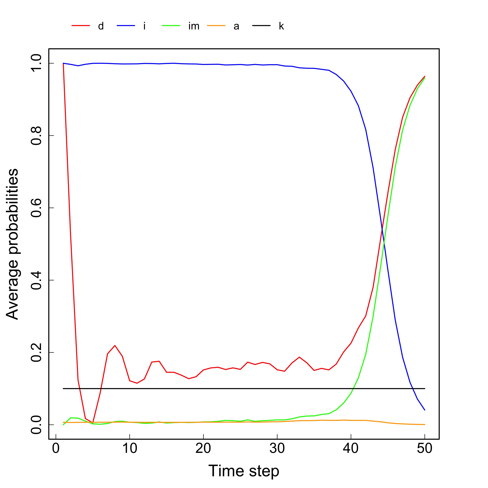
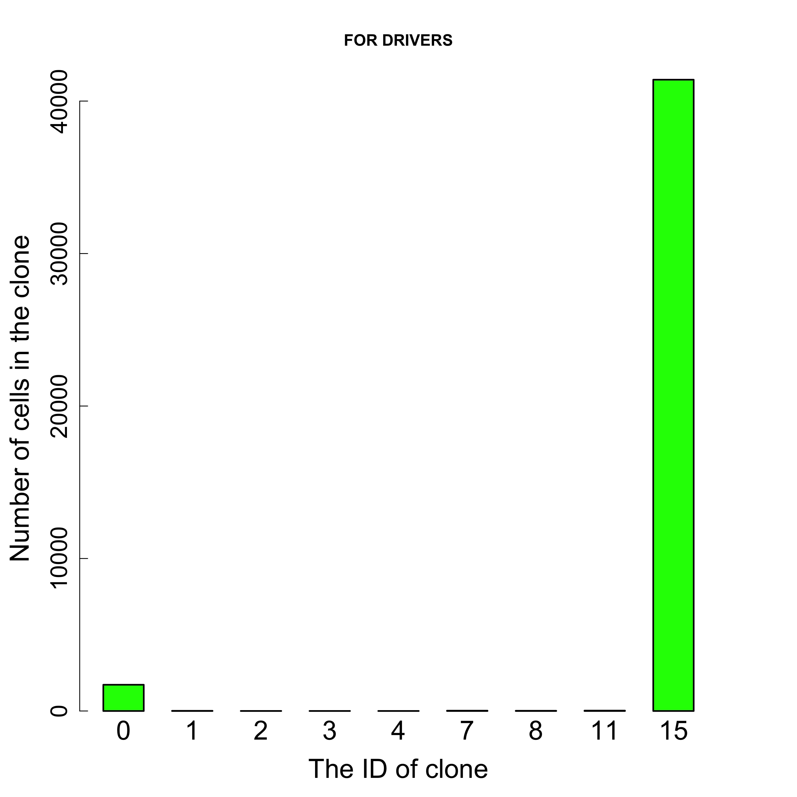
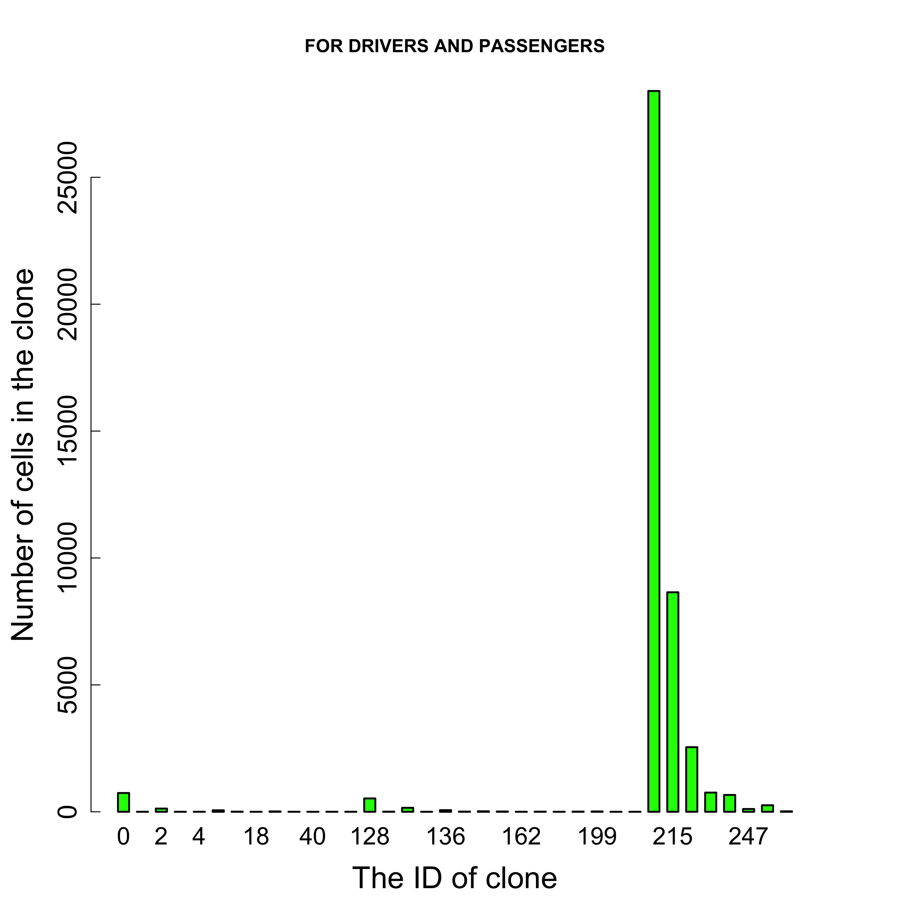
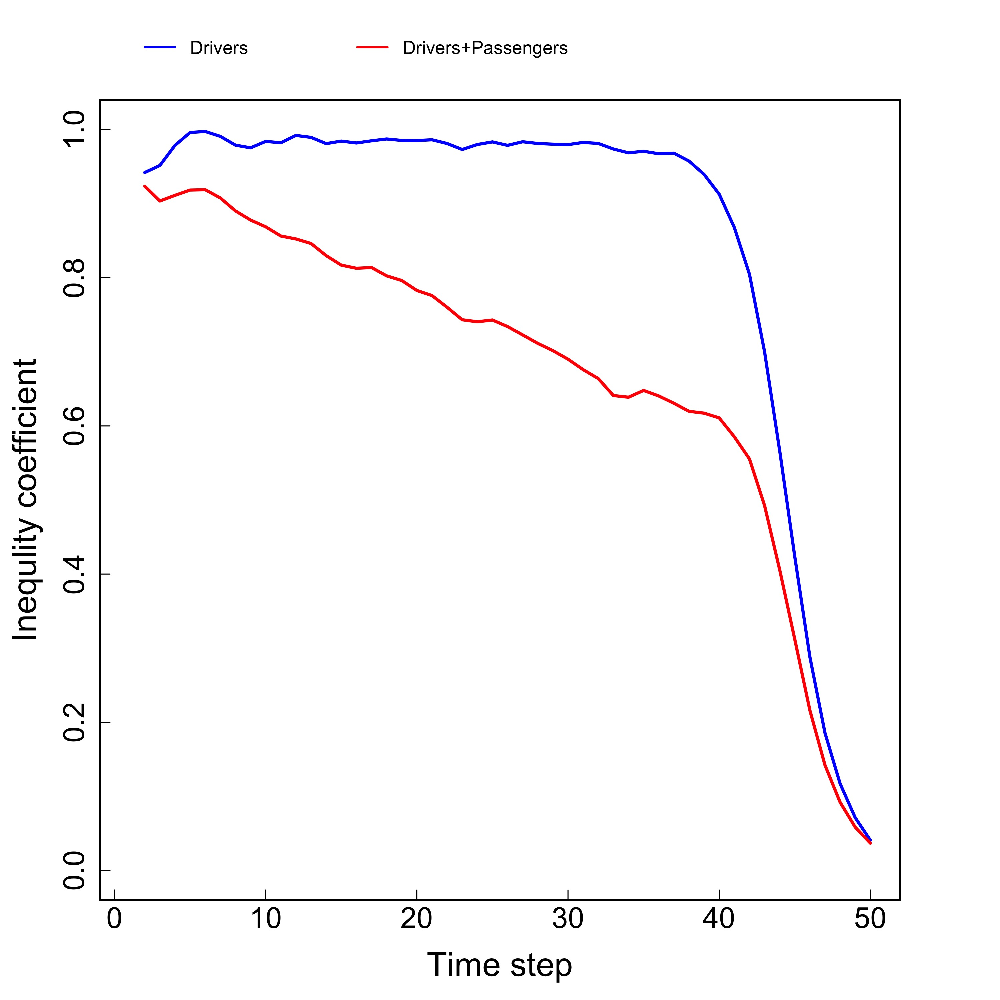
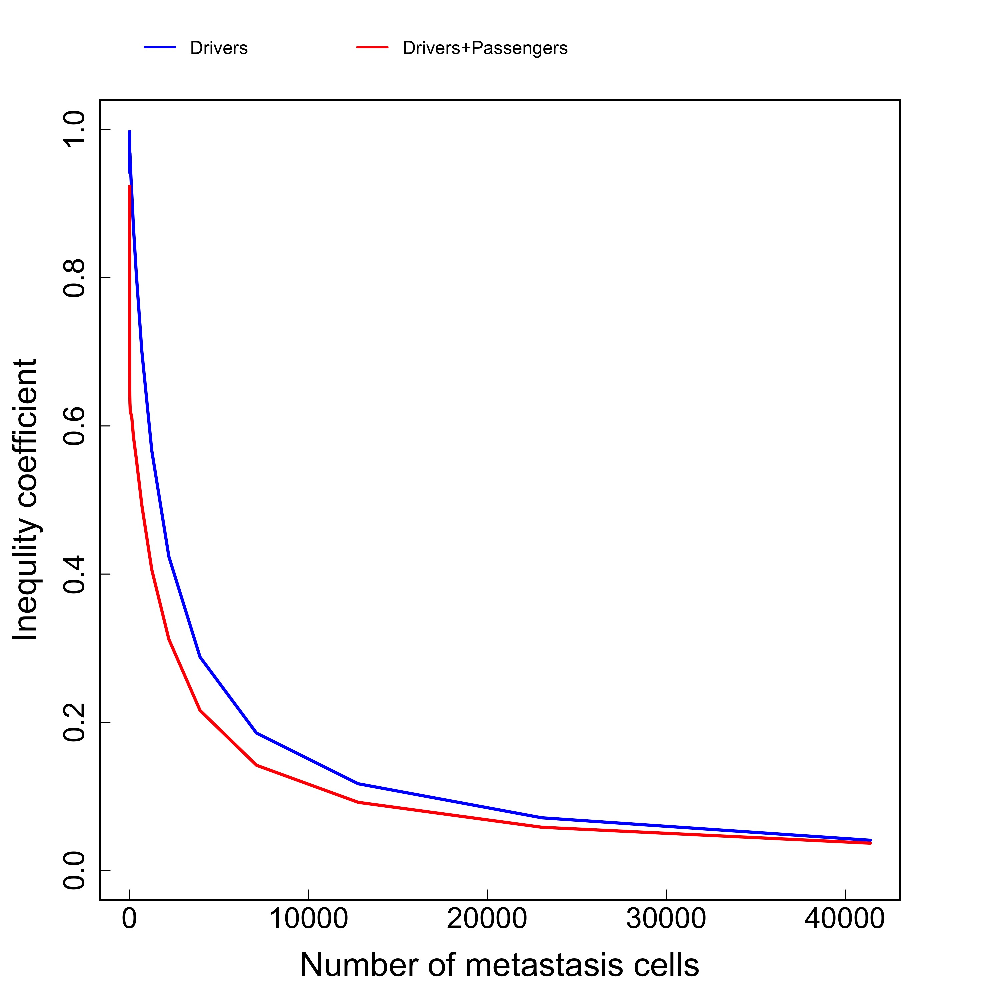

```{r setup, include = FALSE}
knitr::opts_chunk$set(
  fig.path='tugHall/Figures/',
  echo=FALSE, 
  warning=FALSE, 
  message=FALSE,
  collapse = TRUE,
  comment = "#>"
)

Sys.setenv("TimeZone" = "Japan")
```

**tugHall** _(**tu**mor **g**ene-**Hall**mark)_ is a simulator of a cancer-cell evolution model, wherein gene mutations are linked to the tumor cell behaviors that are influenced by the hallmarks of cancer.

This is a script in _**R**_ to simulate the cancer cell evolution in the framework of the model proposed by 
_**prof. Mamoru Kato**_, 
_Head of Bioinformatics Department, Research Institute, Nation Cancer Center, Tokyo, JAPAN_.

---

Authors and contributor list: 
--- 
_**Iurii Nagornov**_ 

_**Mamoru Kato**_

_Department of Bioinformatics, Research Institute, National Cancer Center Japan, Tokyo, Japan_ / https://www.ncc.go.jp/en/ri/department/bioinformatics/index.html 

All other known bugs and fixes can be sent to inagonov@ncc.go.jp

---

Abstract
---

The flood of recent cancer genomic data requires a coherent model that can sort out the findings to systematically explain clonal evolution and the resultant intra-tumor heterogeneity (ITH). Here, we present a new mathematical model designed to computationally simulate the evolution of cancer cells. The model connects the well-known hallmarks of cancer with the specific mutational states of tumor-related genes. The cell behavior phenotypes are stochastically determined and the hallmarks probabilistically interfere with the phenotypic probabilities. In turn, the hallmark variables depend on the mutational states of tumor-related genes. Thus, our software can deepen our understanding of cancer-cell evolution and generation of ITH.

---

<left>
{#id .class width=20% height=20%}
</left>

Licence Information 
---
**GNU GENERAL PUBLIC LICENSE** Version 3 from 29 June 2007

---

Project source can be downloaded from website:
--- 
https://github.com/nagornovys/Cancer_cell_evolution

---

## Input parameters

### Hallmarks variables

Trial probabilities and hallmark variables are listed in the model description. 
The variable of hallmark $x$, $H_x$, is calculated as a linear combination of the weights, $w^x_i$, and the gene indicator variables, $g^x_i$, as follows: 

$$
H_x = \sum^{n_x}_{i=1}{w^x_i \cdot g^x_i},
$$

$$ 
\textrm{such that}~~~~
\sum^{n_x}_{i=1}{w^x_i}=1,~~~~
0 \leq w^x_i \leq 1
\label{eq:02}
$$

$$
g^x_i = \left\{
  \begin{array}{ll}
    1, & \textrm{when the gene is impared}\\
    0, &  \textrm{otherwise,}
  \end{array}
    \right.
$$
where $n_x$ represents the number of genes related to hallmark $x$. If effective trial probabilities go over $1$ or under $0$ due to hallmark variables, the probability values are set to $1$ or $0$, respectively. This modeling by linear combination is provided for simple interpretability because addition of probabilities is intuitively easy to understand.


There is an input file to define the halmarks variables and weights (first 10 lines):

```{r, echo=FALSE, results='asis'}
x <- read.csv(file = "tugHall/Input/gene_cds2.txt",header = FALSE, sep = "\t", nrows = 10)
knitr::kable(x, col.names = c("Genes","length CDS","Hallmark","Suppressor or Oncogene","Weights"), align = "c", caption = "**Table 1. Input file for genes.** Example of input file for hallmarks and weights")
```


1. **Genes.** # eg, TP53, KRAS - name of gene.

2. **length CDS** # eg, 2724, 10804 - length of CDS for each gene.

3. **Hallmark.** # eg, apoptosis - name of hallmark.

4. **Suppressor or oncogene.**  # eg, s, o - suppressor (s) or oncogene (o).

5. **Weights.**  # eg, 0.333, 0.5 - weights for hallmark-genes relations.

---


After that the program defines all weights, and all unknown weights equal 0. Note that program makes normalization, so sum of all weights should be equal 1 (first 10 lines): 

```{r, echo=FALSE, results='asis'}
x <- read.csv(file = "tugHall/Output/Weights.txt", header = TRUE, sep = "\t", nrows = 10)
knitr::kable(x,  col.names = c("Genes", "Apoptosis, $H_a$", "Angiogenesis, $H_b$", "Growth / Anti-growth, $H_d$", "Immortalization, $H_i$", 
                               "Invasion / Metastasis, $H_{im}$"), align = "c", caption = "**Table 2. Weights for hallmarks.** Example of weights for hallmarks and genes from input table. Unknown values are equal 0.")
```

1. **Genes** # eg, TP53, KRAS - name of gene.

2. **Apoptosis, $H_a$** # eg, 0.333, 0.5 - weights of hallmark "Apoptosis" with genes.

3. **Angiogenesis, $H_b$** # eg, 0.333, 0.5 - weights of hallmark "Angiogenesis" with genes.

4. **Growth / Anti-growth, $H_d$**  # eg, 0.333, 0.5 - weights of hallmark "Growth / Anti-growth" with genes.

5. **Immortalization, $H_i$**  # eg, 0.333, 0.5 - weights of hallmark "Immortalization" with genes.

6. **Invasion / Metastasis, $H_{im}$**  # eg, 0.333, 0.5 - weights of hallmark "Invasion / Metastasis" with genes.

---


### Probabilities of processes

The all probabilities and the functional dependences are defined in the model description. 
We here explain the trials and hallmarks:


- **Environmental death** A cell probabilistically dies because of various reasons, such as cell turnover (e.g., anoikis from intestinal crypts to villas), or attack by the immune system, at a constant rate, $k$. 

- **Apoptosis and the apoptosis hallmark** A cell probabilistically dies due to apoptosis caused by deviation from the normal state of chromosomes, which can be caused by the accumulation of mutations. 
We modeled this using the sigmoid function of the proportions of impaired genes. Previous studies (@Abbott2006; @Basanta2011; @Monteagudo2014; @Spencer2006) used a linear function, where as a sigmoid function, 
with only one parameter, has a wider representation including an approximately linear function (Figure 1). 
The "evading apoptosis" (@Hanahan2000), or simply "apoptosis" hallmark decreases the probability of apoptosis through $a - H_a$, 
where $a$ is the probability of apoptosis and $H_a$ is the hallmark variable of apoptosis.

- **Invasion / metastasis transformation and the invasion / metastasis hallmark** A cell probabilistically transforms into a metastatic-tumor type growth from the primary-tumor type growth form (the growth types are described later). 
A cell is put to this trial only when genes related to invasion / metastasis are impaired. 
Because it is generally thought that almost all cells die during the metastatic multi-step cascade (@Weinberg2013), 
the probability of this transformation, $im$ is set to $0$ initially. 
This probability is increased by the hallmark of "tissue invasion and metastasis" (@Hanahan2000), 
or simply "invasion / metastasis" hallmark, through $0 + H_{im}$, where $H_{im}$ is the variable of this hallmark. 

- **Hayflick limit (immortalization) and the immortality hallmark** A cell stops cell division forever (immortalization) if the number of cell divisions goes over a certain threshold called the Hayflick limit. 
This is quantified by setting $i_0$, the probability of forcibly stopping cell division, to $1$. 
However, if genes associated with Hayflick limit are impaired, 
a cell restores its ability to divide, which is represented by $i_0 - H_i~~(i_0=1)$, 
where $H_i$ represents the hallmark variable of "limitless replicative potential" (@Hanahan2000), or simply "immortality".

- **Cell division, and the oncogene / suppressor and angiogenesis hallmarks** A cell probabilistically starts cell division. Cell division takes two forms: 
a localized growth form observed in a primary tumor, and an unlimited growth form effectively observed in a metastatic tumor.
 The unlimited growth form applies to cells that survive the invasion / metastasis trial; and the localized growth form applies to the other cells. 
 We refer to the former and latter cells as the metastatic- and primary-tumor type cells, respectively. 
The unlimited and localized growth forms are formalized by exponential and logistic growth (on average across times and cells), 
via the effective division rate shown in  Table 2. The effective division rate for both forms consists of an initial division rate, $d_0$, 
and the incremental term $+ H_d$.  
$H_d$ is a hallmark variable that brings together two original hallmarks, "self-sufficiency in growth signal" and "insensitivity to anti-growth signals" 
(@Hanahan2000).  
These two hallmarks were grouped because we concluded that both hallmarks have the same effect when genes related to these hallmarks are impaired, 
such as in the case of *KRAS* in the former and *RB1* in the latter. 
In this case, the former and latter hallmarks correspond to oncogenes and tumor suppressor genes; 
hence, we called this variable the "oncogene / suppressor" hallmark variable for short.  
The division rate for logistic growth is decreased by the term $- E' \times N$ (Table 2), 
where $E'$ is a variable related to carrying capacity (described below) and $N$ is the number of surrounding (primary-tumor type) cells. 
The term represents a "brake" that detains the growth speed more aggressively as the number of surrounding cells increases, to simulate competition for resources. 
Mathematically, this logistic growth form has a carrying capacity, i.e., the maximum limit for the number of cells that is determined by $1/E'$.  
Carrying capacity may change when cells acquire the ability to undergo angiogenesis. 
This change is formalized by $E' = E_0 / (1 + F_0 \times H_b)$ (Table 2), 
where $E_0$ is an initially-given parameter and $F_0$ is the increase rate for $H_b$, 
which is the hallmark variable of "sustained angiogenesis" (@Hanahan2000), 
or simply angiogenesis. If no genes related to the angiogenesis hallmark are impaired, then the carrying capacity, 
$1/E'$, is $1/E_0$ because $H_b$ is equal to $0$. $H_b$, by definition, ranges from $0$ to $1$. 
When $H_b$ is equal to $1$, corresponding to the acquisition of full angiogenesis ability, the carrying capacity is $(1 + F_0) / E_0$, 
increased from $1$ to $1 + F_0$ in the coefficient.

- **Gene mutation** Mutations probabilistically occur following a binomial distribution along exons when a cell division occurs. 

- **Gene dysfunction** When mutations occur, they are probabilistically classified into those that cause gene dysfunction or not, which, in this study, 
are called driver or passenger mutations, respectively. 
Gene-dysfunction probability for oncogenes and suppressor genes can be different.
 For oncogenes, mutations must occur at special sites to incur gain-of-function, 
 as typically observed in oncogenes such as *PIK3CA* (@Vogelstein2013). 
 For suppressors, many sites can cause loss-of-function as typically observed in *RB1* (@Vogelstein2013). 
 Impaired genes are recorded and all hallmark variables are re-calculated to start the next iteration of simulation. 

---


**Parameter values**

We will explain the possible parameter values:

- $c_{max,0}$: Hayflick limit is considered to be $40 - 60$, and, in culture, the Hayflick limit of fibroblasts is $50$. We set it to $50$ in this study.

- $k_0$: The probability of environmental death; it is unknown. In this study, we arbitrarily assigned it a value of $0.19$, 
which can be changed depending on the simulation targets.


- $d_0$: The initial probability of division. This rate is assigned a value representing an arbitrary time unit. We assigned $0.1$, 
which means that one cell division occurs per ten time units on average.

- $s_0$: This parameter is the only parameter that changes the sigmoid function. 
The possible values (from 10 to 90) cover a wide range of the possible patterns of sigmoid functions. 
Among the possible values, we assumed $10$ in our simulations.

- $i_0$: Denotes the probability that a cell stops dividing when it uses up a finite telomere length. Here, it was assigned a value of $1$. 

- $m_0$: Parameter to define the probability of the occurrence of point mutations, which has been estimated in many studies 
(@Preston2010; @Wang2014; @Watson2013; @Williams2018). 
The possible values in  Table 1 sufficiently cover the estimated values. Here, we used $10^{-6}$. 

- $u_{o,0}$, $u_{s,0}$: Probabilities that oncogenes and suppressor genes are impaired by point mutations, respectively. 
These values are unknown but the possible values reasonably cover the range in orders of magnitude. 
For reference, the fractions of non-synonymous and nonsense changes in the codon table are about $2/3$ ($66\%$) and $3/(64-3) (5\%)$, respectively. 
We used $0.5$ for $u_{o,0}$ and $0.5$ for $u_{s,0}$ as the simplest case. 

- $E_0$: This environmental variable gives the maximum number for logistic growth as $1/E_0$. 
The maximum distance from a capillary that a cell can survive is $0.2$~mm (@Weinberg2013), 
the diameter of which can contain an order of $10^3$ tumor cells (@Friberg1997). 
Thus, $10^{-3}$ for $E_0$ is a reasonable estimation. 

- $F_0$: This parameter serves to extend the maximum cell number defined by $E_0$ through angiogenesis. 
If capillaries extend $10$ times in length from a main blood vessel, 
$F_0$ will become $10^3$ times greater, as it is associated with volume. 
The possible values give a sufficient range within orders of magnitude when capillaries extend 
by $10$, $10^2$, and $10^3$ times their original length. Here, we used $1$ for $F_0$ for the reason of the computational cost; 
the number of cells increased dramatically for larger $F_0$.


**The other parameters:** 

- The number of tumor cells detected in diagnosis: $10^9$ (@Friberg1997).

- The number of tumor cells that cause patient death: $10^{12}$ (@Friberg1997).


###Input the probabilities

The input of probabilities is possible in the code **"tugHall.R"**:

**E0 <- 2E-4**    # parameter in the division probability  
**F0 <- 1E0**     # parameter in the division probability  
**m <-  1E-6**    # mutation probability  
**uo <- 0.5**     # oncogene mutation probability  
**us <- 0.5**     # suppressor mutation probability  
**s <-  10**      # parameter in the sigmoid function  
**k <-  0.1**     # Environmental death probability  

---

Also in the code we can define names of input and output files, and additional parameters of simulation:

**genefile <- 'gene_cds2.txt'**     # file with information about weights  
**cellfile <- 'cellinit.txt'**      # initial Cells  
**geneoutfile <- 'geneout.txt'**    # Gene Out file with Hallmarks  
**celloutfile <- 'cellout.txt' **   # output information of simulation  
**logoutfile <-  'log.txt' **       # log file to save the input information of simulation  
**censore_n <- 30000  **     # Max cell number where the program forcibly stops  
**censore_t <- 200 **        # Max time where the program forcibly stops  

---

## Structure of files and directories

In the root directory:

**User-Guide.Rmd ** - the user guide in Rmd format.

**User-Guide.html ** - the user guide in html format.

dir **./tigHall/ ** - the directory with the program.  

<br />

In the **./tigHall/ ** directory:

**tugHall.R ** - program to run a simulation and define the parameters.

dir **/Code/ ** - the folder with the code and the library of functions.

dir **/Input/ ** - the folder with the input files.

dir **/Output/ ** - the folder with the output files.

dir **/Figures/ ** - the folder with figures of the plots.  

<br />

In the **/Code/** directory:

**CanSim.bib, pic_lic.jpg** - the necessesary files for user guide.

**tugHall_functions.R** - the file with the functions for a simulation / core of program.

**Analysis.R** - the file to analyse the results of a simulation and plot figures.

**Functions.R** - the file with the functions for the analysis of results.  

<br />

In the **/Input/** directory:

**cellinit.txt ** - the file with a list of the initial cells with/without destroyed genes. 

**gene_cds2.txt** - the file with the halmarks variables and the weights in the format of Table.1.


<br />

In the **/Output/** directory:

**cellout.txt** - the file with output of simulation in the format of Table.3 (see below).

**geneout.txt** - the file with information about halmarks variables and the weights.

**log.txt ** - the file with information about all parameters. 

**Order_of_dysfunction.txt ** -  the file with an information about order of gene dysfunction during evolution in the format of Table.4 (see below).

**Weights.txt ** - the file with information about weights between hallmarks and genes in the format of Table.2.

**VAF.txt ** - information about variant allel frequency (VAF) for each gene and each site in the genes in the format of Table.5 (see below).

<br />

In the **/Figures/** directory there are 13 figures of the *.jpg format, which appear after analysis of simulation. The examples and the descriptions are below in the section "Output data after the simulation". 


## How to RUN the simulation
In order to make the simulation, please, follow next procedure:

1. Copy **/tugHall/** directory into the working directory.

2. CD to the **/tugHall/** directory. 

3. Run **tugHall.R** file, where:
  - load *library(stringr)* and *source(file = "Code/tugHall_functions.R")*;
  - create the Output and Figures directories, if it is needed;
  - define the parameters of simulation; 
  - make of the input file for initial cells, if it is needed;
  - run *model()* function to simulate;
  - run *source("Code/Analysis.R")* in order to analyse the results and plot figures.
  
4. To make report of simulation, please, rename and change "User-Guide.RMD", which uses the output and input files in **/Input/, /Output/, /Figures/** directories.


## Output data after the simulation

Output data content several files and many figures. The "log.txt" and "geneout.txt" files have copied input information about variables and gene names. "Weights.txt" has information about weights of genes for hallmarks. "Cellout.txt" has information about dynamics of cell evolution and all variabls (see below). "Order_of_dysfunction.txt" has information about order of gene dysfunction during evolution (see below example). "VAF.txt" file has information about variant allel frequency for each gene and each site in the genes, which were mutated (see description below). And finally, the folder "Figures/" has many plots (see examples below).

### Contents of "cellout.txt" file

File "cellout.txt" contents all output data for each cell at each timestep (first 10 lines): 

```{r, echo=FALSE, results='asis'}
x <- read.csv(file = "tugHall/Output/cellout.txt",header = TRUE, sep = "\t", nrows = 10)
x[is.na(x)] <- ""
knitr::kable(x, align = "c", caption = "**Table 5. Output data.** Example of output data for all cells. The names of columns are related the description in the Tables 1,2 and Figures 2,3")
```

1. **Time** # eg, 1, 50 - the time step.
2. **AvgOrIndx** # eg, avg, 4,7 - "avg" is for lines with averaging values, index like 1,4,5 etc. is for cells index at the current time step.
3. **ID** # eg, 1, 50 - the unique ID of cell.
4. **ParentID.Birthday** # eg, 0:0, 45:5 - the first number is parent ID, the second number is birthday time step.
5. **c** # eg, 0, 7 - the counter of cell divisions.
6. **d** # eg, 0.1, 0.8 - the value of probability of division for the cell.
7. **i** # eg, 0.1, 0.8 - the value of probability of immortalization for the cell.
8. **im** # eg, 0.1, 0.8 - the value of probability of invasion/metastasis for the cell.
9. **a** # eg, 0.1, 0.8 - the value of probability of apoptosis for the cell.
10. **k** # eg, 0.1, 0.8 - the value of probability of death due to the environment for the cell.
11. **E** # eg, 10^4, 10^5 - the coefficient for the function of the division probability.
12. **N** # eg, 134, 5432 - the number of normal cells at this time step.
13. **Nmax** # eg, 10000, 5000 - the maximal number of normal cells for the cell.
14. **M** # eg, 16, 15439 - the number of metastasis cells at this time step.
15. **Ha** # eg, 0.1, 0.4444 - the value of the hallmar "Apoptosis" for the cell.
16. **Him** # eg, 0.1, 0.4444 - the value of the hallmar "Invasion / Metastasis" for the cell.
17. **Hi** # eg, 0.1, 0.4444 - the value of the hallmar "Immortalization" for the cell.
18. **Hd** # eg, 0.1, 0.4444 - the value of the hallmar "Growth / Anti-growth" for the cell.
19. **Hb** # eg, 0.1, 0.4444 - the value of the hallmar "Angiogenesis" for the cell.
20. **type** # eg, 0, 1 - the type of the cell: "0" is normal cell, "1" is metastasis cell.
21. **mut_den** # eg, 0, 0.32 - the density of the mutation for the cell.
22. **PosDriver.(Gene_1="APC")** # eg, 3493:4, 4531:34 - the first number is the site and the second number is the time step of mutation for the gene with driver mutation.
23. **PosDriver.(Gene_2="KRAS")** # eg, 3493:4, 4531:34 - the first number is the site and the second number is the time step of mutation for the gene with driver mutation.
24. **PosDriver.(Gene_...)** # eg, 3493:4, 4531:34 - the first number is the site and the second number is the time step of mutation for the gene with driver mutation.
25. **PosDriver.(Gene_last="PIK3CA")** # eg, 1, 3493:4, 4531:34 - the first number is the site and the second number is the time step of mutation for the gene with driver mutation.
26. **PosPassngr.(Gene_1="APC")** # eg, 933:8, 3825:24 - the first number is the site and the second number is the time step of mutation for the gene with passenger mutation.
27. **PosPassngr.(Gene_2="KRAS")** # eg, 933:8, 3825:24 - the first number is the site and the second number is the time step of mutation for the gene with passenger mutation.
28. **PosPassngr.(Gene_...)** # eg, 933:8, 3825:24 - the first number is the site and the second number is the time step of mutation for the gene with passenger mutation.
29. **PosPassngr.(Gene_last="PIK3CA")** # eg, 933:8, 3825:24 - the first number is the site and the second number is the time step of mutation for the gene with passenger mutation.
30. **Clone.number** # eg, 15, 4 - the clone number is calculated from binary code of mutated genes. For example, if gene is mutated then its value in binary code equal 1, and if no, it is 0. For example, the cells have only 4 genes in simulation, so "Clone.number" can have binary numbers from 0000 to 1111, that is related decimal numbers from 0 to 15.
31. **Passengers.Clone.number** # eg, 15, 4 - same as for "Clone.number", but for passenger mutations.
32. **Mix.Clone.number** # eg, 35, 16 - same as for "Clone.number", but for passenger and driver mutations together.

---

### "Order_of_dysfunction.txt" file

"Order_of_dysfunction.txt" has information about order of gene dysfunction during evolution in the next format (first 10 lines):

```{r, echo=FALSE, results='asis'}
x <- read.csv(file = "tugHall/Output/Order_of_dysfunction.txt",header = TRUE, sep = "\t", nrows = 10)
x[is.na(x)] <- ""
names(x) <- c("Order of gene dysfunction","Number of cells")
knitr::kable(x, align = "c", caption = "**Table 6. Order of gene dysfunction.**")
```

1. **Order of gene dysfunction.** Order of gene dysfunctionis is the list of gene's names in the order of mutations - from first to last. Blank line is related to the normal cells.
2. **Number of cells.** The number of cell is number of cells in the pool with same order. 

---

### "VAF.txt" file

"VAF.txt" file has information about variant allel frequency (VAF) for each gene and each site in the genes, which were mutated (first 10 lines):

```{r, echo=FALSE, results='asis'}
x <- read.table(file = "tugHall/Output/VAF.txt",header = TRUE, sep = "\t", nrows = 10)
x[is.na(x)] <- ""
knitr::kable(x, align = "c", caption = "**Table 7. Variant allel frequency.**")
```


1. **DriverPasngr.** # D or P to indicate distinction between Driver and Passenger.

2. **Gene.** # eg, TP53, KRAS - name of gene.

3. **Position.** # eg, 123, 1000 - position at mutated site in gene.

4. **VAF_Primary.** # eg, 0.2 - VAF for Primary cells = half of N_mutated_Primary / N_Primary cells

5. **Ncells_Primary_wMutation.**  # eg, 40 - number of Primary mutated cells N_mutated_Primary

6. **Ncells_Primary.**  # eg, 100 - number of Primary cells

7. **VAF_Metastatic.** # VAF for Metastatic cells = half of N_mutated_Metastatic / N_Metastatic

8. **Ncells_Metastatic_wMutation.** # number of Metastatic mutated cells N_mutated_Metastatic

9. **Ncells_Metastatic.** # number of Metastatic cells N_Metastatic

10. **VAF_PriMet.** # VAF for all cells = half of N_mutated_cells / N_all

11. **Ncells_PriMet_wMutation.** # number of all mutated cells

12. **Ncells_PriMet.** # number of all cells

---

### "Figures/" folder and output plots

The directory "Figures/" contents many output figures, generated during analysis process of "cellout.txt" file, including evolutions of number of normal and metastasys cells (Fig.4A), hallmarks (Fig.4B) and probabilities (Fig.5A). 

 
**Fig.4. Results of simulation: left -** evolution of number of cells, **right -** evolution of hallmarks.


---

 
**Fig.5. Results of simulation: left -** evolution of probabilities, **right -** evolution of number of clones.


---

Fig.5B shows the evolution of number of clones. Here we have to define clone in simulation is pool of cells with a same set of mutated genes for driver only or for all mutations (driver and passenger). For this propose we define clone ID as bunary number of mutated genes, please, see "cellout.txt" file for columns "Clone.number", "Passengers.Clone.number" and "Mix.Clone.number". Also analysis can calculate the evolution of number of cells in each clone:


 
**Fig.6. Results of simulation: left -** evolution of number of cells in clones, **right -** same plot with scale out.

---

Fig.7 shows number of cells in each clone at last time step to see which clone is dominant and prevails above others:

 
**Fig.7. Results of simulation: left -** barplot for number of cells in clones for driver mutated clone, **right -** same plot for all mutated cells.

---

During the simulation each cell has "ID of clone", which calculated from binary code of mutated genes. For example, if gene is mutated then its value in binary code equal 1, and if no, it is 0. For example, the cells have only 4 genes in simulation, so "ID of clone" can have binary numbers from 0000 to 1111,  that is related decimal numbers from 0 to 15. Each cell has information about parent ID and time of birthday, so it is possible to calculate cells with same "ID of clone", after that find cell with earlest birthday and get parent ID of it. Using this parent ID to find "ID of clone" for parent, which is related parent of clone. Follow this procedure we find all relations between parent and children for clones and construct the tree for clones (cells) at last time step (Fig.8).

 
**Fig.8. Tree of clones at last time step.** The numbers of tree indicate the ID of clones barplot for number of cells in clones for driver mutated clone.


---

Figs.9 and 10 shows inequality coefficients (for driver mutated cells and for any type mutation) as function of:

- time step;

- number of all cells; 

- number of normal cells; 

- number of metastasis cells.


 
**Fig.9. Results of simulation of inequality coefficient for driver mutated cells and for cells with any type mutations: left -** evolution of inequality coefficient, **right -** inequality coefficient as function of all cells.


 
**Fig.10. Results of simulation of inequality coefficient for driver mutated cells and for cells with any type mutations: left -** inequality coefficient as function of normal cells, **right -** inequality coefficient as function of metastasis cells.


--- 


Funding
---
This work was supported by CREST-JST (14531766); MEXT (15K06916); and AMED (16ck0106013h0003).

Acknowledgements
---
We thank Asmaa Elzawahry, Yusuke Suenaga, Sana Yokoi, Yoshitaka Hippo, Atsushi Niida, and Daniel A. Vasco for useful suggestions.


---

## References

